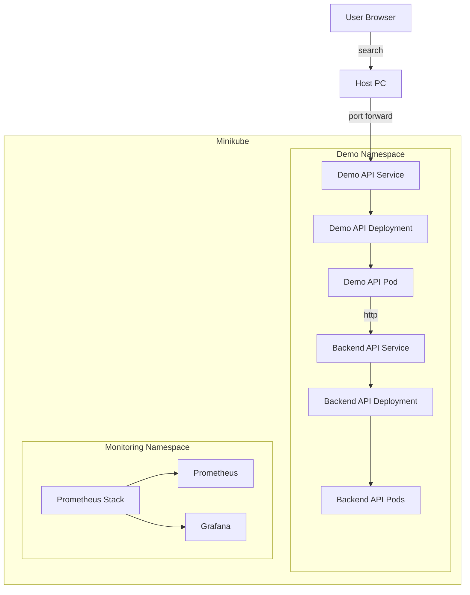
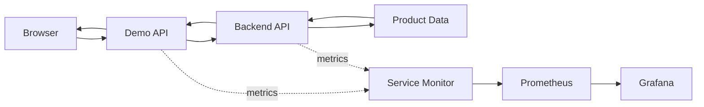
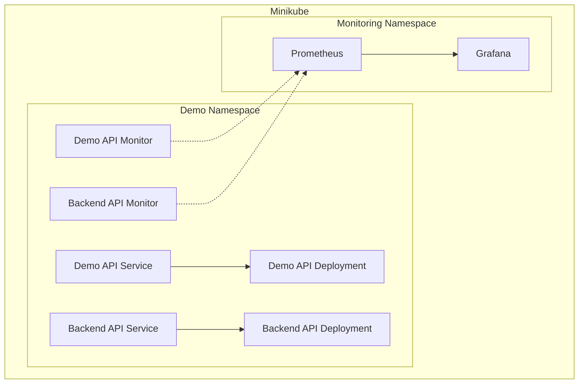
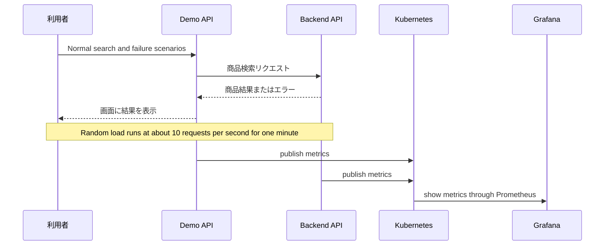
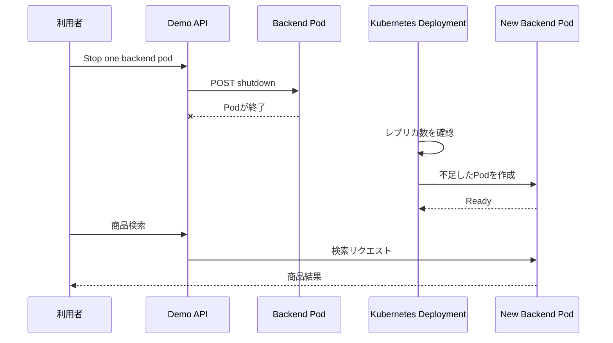

# アーキテクチャ

このプロジェクトは、商品検索を題材にしたオブザーバビリティのデモです。
ブラウザから検索したリクエストが2つのAPIを通り、同時にリクエスト数・応答時間・エラーなどがPrometheusへ集められ、Grafanaで確認できます。

## 全体構成



### 役割

| 要素 | 役割 |
| --- | --- |
| 利用者 / ブラウザ | 商品検索やデモ操作を行う入口 |
| demo-api | 検索画面を表示し、backend-apiへ検索を中継 |
| backend-api | アプリ内の固定商品データを検索して返す |
| demo-api Service | 外部からdemo-apiへ接続する入口 |
| backend-api Service | backend-api Podへリクエストを振り分ける内部入口 |
| Prometheus | APIが公開するメトリクスを収集・保存 |
| Grafana | Prometheusのデータをグラフで表示 |

## Kubernetes上のデータの流れ



実線は商品検索のリクエスト、点線は観測用のメトリクス収集を表します。
ServiceMonitorは3秒間隔で各Serviceの`/metrics`を収集します。

## Minikubeの構成



アプリケーションのコンテナイメージは、通常のDockerレジストリから取得せず、次のコマンドでMinikubeが利用できる場所へビルドします。

```shell
minikube image build -t demo-api:latest ./demo-api
minikube image build -t backend-api:latest ./backend-api
kubectl apply -f deploy
```

Deploymentでは`imagePullPolicy: Never`を指定しているため、コード変更後はイメージを再ビルドし、必要に応じてDeploymentを再起動します。

## デモで観測するもの



画面上の負荷テストを実行すると、正常なレスポンスだけでなく、遅延やHTTPエラーも発生します。その変化をGrafanaで見ることで、アプリケーションの状態を数字とグラフで把握できます。

## Kubernetesの自己修復



backend-apiは2レプリカで動作しています。画面の停止ボタンはService経由で通常1つのPodを終了させますが、Deploymentが不足分を自動的に作り直すため、最終的に2レプリカへ戻ります。

## ローカルからのアクセス

```shell
# 商品検索アプリ
kubectl port-forward -n demo svc/demo-api 8000:8000
# http://localhost:8000

# Prometheus
kubectl port-forward -n monitoring \
  svc/monitoring-kube-prometheus-prometheus 9090:9090
# http://localhost:9090

# Grafana
kubectl port-forward -n monitoring svc/monitoring-grafana 3000:80
# http://localhost:3000
```
